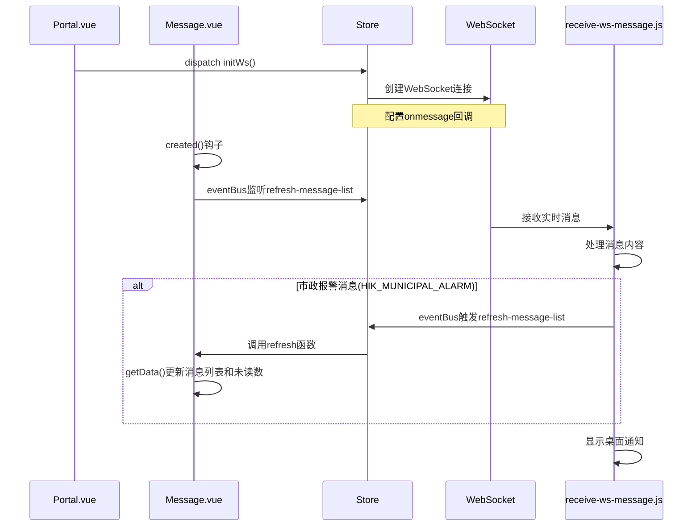

# WorkRecord

## StoryBook, historie

这种类似的文档开发工具可以独立于项目的形式实现组件独立可视化，并且还可以给 prop,slot 等添加自定义显示。

```js
export default {
    title: '工具名称',
    component: 组件名称,
    tags: [], // 可以包括'autodocs'(自动文档)等
    argTypes: {
        // props
        prop1: {
            control: { // 表示该属性的控制方式
                type: '', // 表示该属性的类型，常见的有'select'(下拉框), 'text'(文本框)等
            },
            options: [], // 该属性的选项，只有type为'select'时才有效
        },
        ...
    },
    args: {
        // emit
        emit1: fn(), // 表示该属性的回调函数
    }
```

## CI/CD

## 大模型的前端构建

打字机、组件组装、流式 API

### 打字机

打字机指的是大模型输出的文字在前端展示时，需要一个打字机效果，即逐字显示，而不是一次性显示所有内容。这种效果可以给用户一种沉浸式的体验，让他们感觉自己正在与大模型进行对话。

### 流式 API

流式 API 指的是大模型 API 的流式响应，即返回的数据是分块返回的，而不是一次性返回的。这种 API 在处理大模型时非常有用，因为它可以避免一次性加载所有数据而导致的性能问题。

```js
/* fetch 发起请求 */
const fetchStreamData = async (prompt) => {
    const response = await fetch("https://api.openai.com/v1/completions", {
        method: "POST",
        headers: {
            "Content-Type": "application/json",
            Authorization: `Bearer YOUR_API_KEY`,
        },
        body: JSON.stringify({
            model: "gpt-4",
            prompt: prompt,
            stream: true, // 启用流式响应
        }),
    });

    // 检查响应状态
    if (!response.ok) {
        throw new Error("Network response was not ok");
    }

    // 获取响应的可读流并处理流数据
    const reader = response.body.getReader();
    const decoder = new TextDecoder("utf-8");
    let done = false;

    while (!done) {
        // 读取流中的下一个数据块
        const { value, done: readerDone } = await reader.read();
        done = readerDone;

        // 将数据块解码为字符串
        const chunk = decoder.decode(value, {
            stream: true,
        });
        // ***** 这需要注意，各个大模型的分块数据结构可能不一样，甚至会有可能出现部分数据的情况，要单独兼容和处理哦
        // 以及有些模型内容的路径不一样，一次性响应在content，但是流式在delta字段下
    }
};

/* 逐步更新 */
const chatBox = document.getElementById("chat-box");
const updateChat = (text) => {
    // 将新数据块追加到界面上
    chatBox.innerHTML += `<p>${text}</p>`;
};
// 在逐块接收时更新
while (!done) {
    const { value, done: readerDone } = await reader.read();
    const chunk = decoder.decode(value, {
        stream: true,
    });
    updateChat(chunk); // 实时更新聊天框
}
```

## 逆向函数获取元素位置信息

通过逆向函数获取元素位置信息的方法是通过 JavaScript 的 DOM 操作来获取元素的位置信息，逆向位置获取函数，通过点击事件获取元素的位置信息。

## 通过 v-if 实现异步消息时，父组件与子组件的信息传递不会异常

```vue
<!-- 父组件 -->
<template>
    <div>
        <div v-if="isShow">
            <child-component :message="message" />
        </div>
    </div>
</template>
<script>
export default {
    data() {
        return {
            isShow: false, // 控制子组件是否显示
            message: '' // 子组件的消息
        }
    }
    methods: {
        async getAsyncMessage() {
           setTimeout(() => {
                this.message = '异步消息'; // 异步获取消息
                this.isShow = true; // 显示子组件
           }, 1000);
        }
    }
}
</script>
<!-- 子组件 -->
<template>
    <div>
        <p>{{ message }}</p>
    </div>
</template>
<script>
export default {
    props: {
        message: {
            type: String,
            default: "",
        },
    },
};
</script>
```

## 用防抖可以防止 created 和 某些 change 事件的多次触发

样例事件

```vue
<template>
    <div>
        <input
            type="text"
            v-model="inputValue"
            @input="handleInput"
        />
    </div>
</template>

<script>
export default {
    data() {
        return {
            inputValue: "",
            debouncedGetData: null, // 防抖函数
        };
    },
    methods: {
        // 防抖函数
        debounce(fn, delay) {
            let timer = null;
            return function (...args) {
                if (timer) clearTimeout(timer);
                timer = setTimeout(() => {
                    fn.apply(this, args);
                }, delay);
            };
        },

        async getData() {
            // 获取数据
            console.log("正在获取数据...");
            // 这里是获取数据的逻辑
            // 例如 API 请求等
        },

        handleInput() {
            // 处理输入
            console.log("正在处理输入...");

            // 调用防抖后的函数
            this.debouncedGetData();
        },
    },
    created() {
        // 调用防抖后的函数
        this.debouncedGetData = this.debounce(this.getData, 300); // 防抖时间为 300ms

        this.debouncedGetData();
    },
};
</script>
```

## v-if, Transition 和 video

Transion 的`leave-active-class`是在元素离开过渡过程中应用的类名。但是`leave-active-class`表示元素已经离开，内部元素已经销毁，不会再响应相应的事件。为此，如果要在元素离开过渡后执行一些操作，需要用到`setTimeout`对元素离开进行延时操作，再次之前执行内部元素的事件。

## axios 的 responseType 设置

当使用 axios 发送请求时，可以通过设置`responseType`属性来指定响应数据的类型。`responseType`可以设置为以下几种类型：

### 实习场景

当给 http 的请求不设置`responseType`属性时，axios 会默认认为`responseType`为`json`，此时如果解析二进制数据等会报错。

### `responseType`的类型

- `arraybuffer`：返回一个 ArrayBuffer 对象，用于表示响应数据的原始二进制数据，常用于处理文件下载等场景。
- `blob`：返回一个 Blob 对象，用于表示响应数据的二进制数据，常用于下载 PDF、图片等文件。
- `text`：返回一个字符串，用于表示响应数据的文本数据，常用于显示纯文本。
- `json`：返回一个 JavaScript 对象，用于表示响应数据的 JSON 数据。
- `document`：返回一个 HTMLDocument 对象，用于表示响应数据的 HTML 文档。
- `stream`：返回一个 ReadableStream 对象，用于表示响应数据的流数据，常用于处理大文件上传等场景。当前`XMLHTTPRequest`并不支持，若需要使用，转向`fetch`。

### `blob` 与 `arraybuffer` 的区别

- 定义：
  - `blob`：Blob 对象表示一个不可变、原始数据的类文件对象。它的数据可以按文本或二进制的格式进行读取，也可以转换成 ReadableStream 来用于数据操作。
  - `arraybuffer`：ArrayBuffer 对象用来表示通用的、固定长度的原始二进制数据缓冲区。
- 存储方式：
  - `blob`：数据存储复杂，不仅存在内存，超量时还存在磁盘。
  - `arraybuffer`：数据存储简单，只存在内存。大量数据时，内存占用过大会导致浏览器标签页崩溃。

## `el-upload`无法获取文件绝对路径

- 原因: 出于安全考虑，浏览器限制了直接获取文件的绝对路径。就算是获取到了，也是 `C://fakepath`。暂时找不到比较好的方法进行解决。

## 动态表单

- 定义:
  动态表单是指在运行时根据需要动态生成的表单，其字段和布局可以根据用户的操作或数据的变化而变化。
- 作用:
  动态表单的作用是为用户提供一种灵活的交互方式，允许用户根据需要自定义表单的字段和布局，而无需手动编写代码。这样可以提高表单的效率和用户的参与度，同时也可以根据不同的场景和需求，提供定制化的表单功能。
- 实现方式:
  动态表单的实现方式有以下几种：
  1. 基于模板引擎：使用模板引擎（如 Vue、React）动态生成表单的 HTML 代码，并根据用户的操作或数据的变化，动态更新表单的字段和布局。
  2. 基于组件库：使用组件库（如 Element UI、Ant Design Vue）提供的动态表单组件，根据用户的操作或数据的变化，动态添加、删除表单的字段和布局。
- 缺陷:
  1. 数据联动的配置较为复杂
  2. 组件库的动态表单组件可能不支持所有的表单元素，需要根据组件库的文档进行配置。
  3. 动态表单的验证和提交逻辑需要手动编写，组件库的动态表单组件可能不支持表单的验证和提交逻辑。
  4. 动态表单的性能问题，当表单字段较多时，性能会下降。

## 重排导致的报错

- 问题出现在，el-form-item或者el-table单行排列时，如果用v-if或者v-show，就会触发ResizeObserver loop completed with undelivered notifications错误。
- 错误原因: el-table Table-column 宽度未定义。在 Element-plus 中，el-table 组件的 Table-column 组件默认没有设置宽度。这意味着表格的宽度是不固定的，当表格尺寸发生变化时，ResizeObserver 会触发多次回调。然而，由于宽度不固定，ResizeObserver 无法准确获取元素的新尺寸，导致错误的产生。
- 解决办法: 
  1. 使用visibility属性代替v-if或者v-show，用占位符的方法，这样可以避免重排。
  2. 设置 Table-column 宽度。为了解决此错误，需要为 Table-column 设置一个固定宽度。这可以通过两种方式实现：
     - 在 Table-column 组件中直接设置宽度：`<el-table-column width="100px"></el-table-column>`
     - 使用 el-table 组件的 column-width 属性设置所有 Table-column 的宽度：`<el-table :column-width="100"></el-table>`

## WebPack 的配置问题

WebPack可以进行一系列配置减少打包时间

### 缓存相关

- no change 65.47s

- devtools: 'eval-cheap-module-source-map' -> 'inline-source-map' 75.69s

- cache:
  
  ```
  cache: {
    type: 'filesystem',
    // 优化缓存配置：移除整个配置文件依赖，只追踪关键构建相关的文件
    buildDependencies: {
      config: [
        path.resolve(__dirname, '../package.json'),
        path.resolve(__dirname, '../babel.config.js'),
        path.resolve(__dirname, '../jsconfig.json')
      ],
      // 只有这些文件变化时才重置缓存
    },
    // 设置缓存名称，便于管理
    name: 'vsrm-cisrm-dev'
  },
  ```

- resolve:

```
    cacheWithContext: false,
    unsafeCache: true
```

### 精灵图插件

SpirtesmithPlugin自动将多个小图标合并成一张雪碧图并生成对应的 CSS 样式，减少 HTTP 请求次数，提高页面加载性能。

```
new SpritesmithPlugin({
  src: {
    cwd: path.resolve(rootPath, "src/assets/icons"),
    glob: "*.png"
  },
  target: {
    image: path.resolve(rootPath, "src/assets/images/sprite.png"),
    css: [[path.resolve(rootPath, "src/assets/styles/sprite.css"), { format: "function_based_template" }]]
  },
  customTemplates: { function_based_template: spritesmithTemplateFunc },
  apiOptions: { cssImageRef: path.resolve(rootPath, "src/assets/images/sprite.png") }
})
```

### Asset Modules

Webpack 5 引入了原生的 Asset Modules 功能，用来替代之前的 `file-loader`、`url-loader` 和 `raw-loader`。这个新特性提供了四种类型：

1. `asset/resource` - 发送单独的文件并导出 URL（类似 file-loader）
2. `asset/inline` - 导出资源的 Data URI（类似 url-loader）
3. `asset/source` - 导出资源的源代码（类似 raw-loader）
4. `asset` - 自动选择发送单独文件还是内联导出（根据大小）

## 父子组件的`activated`生命钩子触发问题

子的组件比父的先触发，因此有时会造成错误，比如子依赖于父的数据，父子都有keep-alive，父亲的activated还没触发，所以子拿不到更新值，就会造成错误。

解决该问题有如下方法：

### 从父组件向子组件发送数据就绪事件

父组件在activated钩子中更新数据后，通过$emit发送事件通知子组件数据已准备就绪，子组件监听该事件后再执行相关逻辑。

```vue
<!-- 父组件 -->
<script>
export default {
  activated() {
    // 更新数据
    this.fetchData().then(() => {
      // 数据更新完成后发送事件
      this.$refs.childComponent.$emit('data-ready');
    });
  }
};
</script>

<!-- 子组件 -->
<script>
export default {
  activated() {
    this.$on('data-ready', () => {
      // 接收事件后执行逻辑
      this.processParentData();
    });
  },
  methods: {
    processParentData() {
      console.log('处理父组件数据:', this.parentData);
    }
  }
};
</script>
```

### 使用状态管理工具共享数据

通过Vuex或Pinia等状态管理工具共享数据，子组件通过状态管理工具获取数据，确保数据已经更新。

```vue
<!-- 子组件 -->
<script>
export default {
  activated() {
    // 从状态管理工具获取数据
    this.parentData = this.$store.state.parentData;
    this.processParentData();
  }
};
</script>
```

## Sroll的冒泡更新机制

具体见: [当我们发现scroll事件不触发之后我们应该做什么scroll事件不触发 为什么绑定的scroll事件失效了？为什么弹窗 - 掘金](https://juejin.cn/post/7209983180912181308)

## vant2 的van-form表单提交机制

具体见：[vant表单中的提交中的一些坑 - 蜘蛛流 - 博客园](https://www.cnblogs.com/cjxstart/p/16079192.html)

## Vue中的副作用

如果在Vue的模板里直接使用一个不带参数的函数，那么这个函数没有依赖，每次渲染都会依赖于整个页面发生的变化，此时请求数据容易形成死循环卡死。

## WebSocket 的应用

WebSocket 是一种在单个 TCP 连接上进行全双工通信的协议。它允许客户端和服务器之间进行实时的双向数据传输，而无需像传统的 HTTP 请求那样每次都需要重新发起请求。

### WebSocket 解决的问题

HTTP 协议是一种无状态的、基于请求-响应模型的应用层协议。这意味着客户端必须主动向服务器发送请求才能获取数据，而服务器无法主动推送数据给客户端。这种机制虽然简单有效，但在某些场景下存在明显的不足：

1. **高延迟**：由于每次交互都需经历完整的握手过程，导致较高的网络开销和延迟；
2. **资源浪费**：频繁地建立和关闭连接会消耗大量的系统资源；
3. **实时性差**：客户端无法及时获得最新的数据更新，只能通过不断轮询的方式来检查是否有新数据到来。

WebSocket 正是为了克服上述缺点而设计的一种新型通信协议。它可以实现在客户端与服务器之间的持久化连接，并支持双方随时互相发送数据，从而大大提高了数据交换效率和用户体验质量。

### WebSocket vs 轮询

轮询是指客户端定期向服务器发出请求以检查是否存在新的数据更新。这种方式的优点在于实现简单，兼容性强；但同时也存在着诸多弊端：

- 频繁的请求会导致大量不必要的网络流量和服务器负载；
- 数据更新可能存在延迟，因为只有在下次轮询时才会发现变化；
- 对于一些对实时性要求较高的应用场景来说，轮询显然不能满足需求。

相比之下，WebSocket 具有如下显著优势：

- **低延迟**：一旦建立起连接，就可以立即进行数据交互，几乎没有额外的时间损耗；
- **节省资源**：只需要一次握手即可维持长期稳定的连接关系，避免了反复创建销毁连接所带来的性能损失；
- **真正的实时性**：无论是哪一方产生的最新信息都可以第一时间通知对方，确保了数据同步的一致性和即时性。

## WebSocket 工作原理

WebSocket 的工作流程大致可分为三个阶段：

1. **握手阶段**：客户端首先发起一个特殊的 HTTP 请求，其中包含了 Upgrade 字段表明希望升级到 WebSocket 协议。如果服务器同意此次升级，则返回相应的确认信息，表示握手成功。

2. **数据传输阶段**：握手完成后，客户端和服务器便可以通过这条已建立好的通道自由地相互传递各种类型的数据帧（如文本、二进制等）。在此期间不再依赖任何应用层协议，而是直接基于 TCP 层来进行可靠的数据流控制。

3. **连接终止阶段**：当任意一方决定结束本次对话时，都会发送一个关闭帧告知另一方准备断开链接。收到此信号后，对方也会做出相应反馈直至最终释放掉所有占用的资源为止。

### WebSocket 常见配置

1. 使用Socket类进行创建

2. 抽出主要内容包括 开启、关闭、报错回调，心跳检测、出错重连等。

3. 心跳检测
   
   ```javascript
     // 周期性发送ping 保活
     heartCheck (timer) {
       this.heartInterval = window.setInterval(() => {
         this.send({ "sessionId": store.state.userId, "timestamp": new Date().getTime() });
       }, timer);
     }
       // 发送消息
     send (message) {
       // readyState 1 表示已经链接并且可以通讯
       if (!this.websocket || this.websocket.readyState !== 1) {
         console.log('请确认websocket是否已经链接并且可以通讯');
         return;
       }
       this.websocket.send(JSON.stringify(message
     ));
     }
   ```

4. 断线重传
   
   ```javascript
     // 断线重连
     reconnect () {
       console.log('开始重连');
       if (this.lockReconnect) return;
       this.lockReconnect = true;
       this.reconnectTimeout && clearTimeout(this.reconnectTimeout);
       this.reconnectTimeout = window.setTimeout(() => {
         this.socketInit(this.params);
         this.lockReconnect = false;
       }, 5000);
     }
   ```

### WebSocket 应用场景

项目中：

1. **Portal 初始化**:
   
   - Portal.vue 组件挂载时调用 `initWs()` 方法
   - 通过 Vuex action `initWs` 创建 WebSocket 连接
   - WebSocket 配置了 `onmessage` 回调函数为 `receiveWebsocketMessage`

2. **Message 组件初始化**:
   
   - Message.vue 组件在 `created` 钩子中监听 `refresh-message-list` 事件
   - 将 `refresh` 方法注册为事件处理函数

3. **消息接收和处理**:
   
   - 当 WebSocket 接收到消息时，调用 `receiveWebsocketMessage` 函数
   - 对于不同类型的报警消息进行相应处理：
     - 显示桌面通知（所有类型）
     - 播放提示音（所有类型）
     - 对于市政报警消息，额外触发消息列表刷新

4. **消息列表刷新机制**:
   
   - 仅对于 `HIK_MUNICIPAL_ALARM` 类型的消息，才会通过 eventBus 触发 `refresh-message-list` 事件
   - Message.vue 组件接收到此事件后，调用 `refresh` 方法
   - `refresh` 方法防抖处理后调用 `getData()` 更新消息列表和未读数量




## 项目整合

### 市政云管网监测项目（微前端架构）：

#### 业务层面

- 实现动态表单架构：根据协议类型动态显示不同表单字段，处理3中协议类型+5种设备类型的差异化逻辑，实现复杂状态管理。
- 智能表单验证系统：集成11种字段验证规则，用工厂模式和策略模式进行优化，通过高阶函数生成不同验证规则（如validateNull、validateRange等）
- 复杂组件整合开发：结合AMap地理编码和反向地理编码开发复合GIS集成组件；通过hatom和微信小程序的api，实现多端带标签的多图上传控件，优化图片上传能力

#### 性能层面

**Webpack优化方案：**

- 配置filesystem缓存，通过buildDependencies精确控制缓存失效
- 多核并行压缩：TerserPlugin和CssMinimizerPlugin启用parallel参数
- 自定义Spritesmith模板函数实现雪碧图自动化生成

#### 其它层面

- **技术架构**：
  
  - 在Vue2 + qiankun微前端架构，在子应用实现开发和部署
  - 基于原生WebSocket实现实时通信系统（含心跳检测、断线重连机制）

- **主要贡献**：
  
  1. 设计实现WebSocket通信框架：
     - 支持自动协议补全、心跳检测(10s间隔)、断线重连
     - 日均处理告警消息5000+条，响应速度提升60%
  2. 搭建微前端架构：
     - 基于qiankun实现主子应用隔离
     - 支持各子应用独立开发部署

- **技术亮点**：
  
  - 自主研发WebSocket通信层，稳定性达99.9%
  - 创新性的微应用消息总线设计
  - 支持多维度预警信息展示