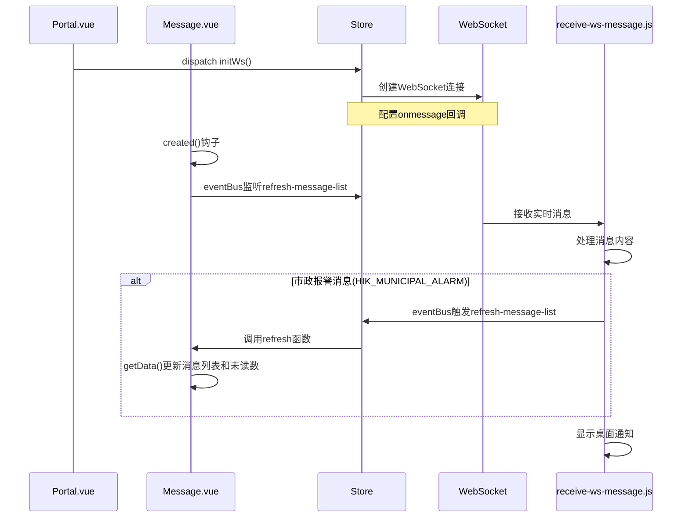
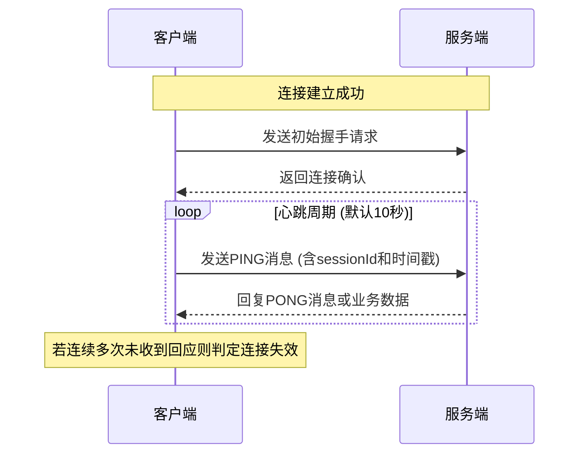

# WorkRecord

## StoryBook, historie

这种类似的文档开发工具可以独立于项目的形式实现组件独立可视化，并且还可以给 prop,slot 等添加自定义显示。

```js
export default {
    title: '工具名称',
    component: 组件名称,
    tags: [], // 可以包括'autodocs'(自动文档)等
    argTypes: {
        // props
        prop1: {
            control: { // 表示该属性的控制方式
                type: '', // 表示该属性的类型，常见的有'select'(下拉框), 'text'(文本框)等
            },
            options: [], // 该属性的选项，只有type为'select'时才有效
        },
        ...
    },
    args: {
        // emit
        emit1: fn(), // 表示该属性的回调函数
    }
```

## CI/CD

## 大模型的前端构建

打字机、组件组装、流式 API

### 打字机

打字机指的是大模型输出的文字在前端展示时，需要一个打字机效果，即逐字显示，而不是一次性显示所有内容。这种效果可以给用户一种沉浸式的体验，让他们感觉自己正在与大模型进行对话。

### 流式 API

流式 API 指的是大模型 API 的流式响应，即返回的数据是分块返回的，而不是一次性返回的。这种 API 在处理大模型时非常有用，因为它可以避免一次性加载所有数据而导致的性能问题。

```js
/* fetch 发起请求 */
const fetchStreamData = async (prompt) => {
    const response = await fetch("https://api.openai.com/v1/completions", {
        method: "POST",
        headers: {
            "Content-Type": "application/json",
            Authorization: `Bearer YOUR_API_KEY`,
        },
        body: JSON.stringify({
            model: "gpt-4",
            prompt: prompt,
            stream: true, // 启用流式响应
        }),
    });

    // 检查响应状态
    if (!response.ok) {
        throw new Error("Network response was not ok");
    }

    // 获取响应的可读流并处理流数据
    const reader = response.body.getReader();
    const decoder = new TextDecoder("utf-8");
    let done = false;

    while (!done) {
        // 读取流中的下一个数据块
        const { value, done: readerDone } = await reader.read();
        done = readerDone;

        // 将数据块解码为字符串
        const chunk = decoder.decode(value, {
            stream: true,
        });
        // ***** 这需要注意，各个大模型的分块数据结构可能不一样，甚至会有可能出现部分数据的情况，要单独兼容和处理哦
        // 以及有些模型内容的路径不一样，一次性响应在content，但是流式在delta字段下
    }
};

/* 逐步更新 */
const chatBox = document.getElementById("chat-box");
const updateChat = (text) => {
    // 将新数据块追加到界面上
    chatBox.innerHTML += `<p>${text}</p>`;
};
// 在逐块接收时更新
while (!done) {
    const { value, done: readerDone } = await reader.read();
    const chunk = decoder.decode(value, {
        stream: true,
    });
    updateChat(chunk); // 实时更新聊天框
}
```

## 逆向函数获取元素位置信息

通过逆向函数获取元素位置信息的方法是通过 JavaScript 的 DOM 操作来获取元素的位置信息，逆向位置获取函数，通过点击事件获取元素的位置信息。

## 通过 v-if 实现异步消息时，父组件与子组件的信息传递不会异常

```vue
<!-- 父组件 -->
<template>
    <div>
        <div v-if="isShow">
            <child-component :message="message" />
        </div>
    </div>
</template>
<script>
export default {
    data() {
        return {
            isShow: false, // 控制子组件是否显示
            message: '' // 子组件的消息
        }
    }
    methods: {
        async getAsyncMessage() {
           setTimeout(() => {
                this.message = '异步消息'; // 异步获取消息
                this.isShow = true; // 显示子组件
           }, 1000);
        }
    }
}
</script>
<!-- 子组件 -->
<template>
    <div>
        <p>{{ message }}</p>
    </div>
</template>
<script>
export default {
    props: {
        message: {
            type: String,
            default: "",
        },
    },
};
</script>
```

## 用防抖可以防止 created 和 某些 change 事件的多次触发

样例事件

```vue
<template>
    <div>
        <input
            type="text"
            v-model="inputValue"
            @input="handleInput"
        />
    </div>
</template>

<script>
export default {
    data() {
        return {
            inputValue: "",
            debouncedGetData: null, // 防抖函数
        };
    },
    methods: {
        // 防抖函数
        debounce(fn, delay) {
            let timer = null;
            return function (...args) {
                if (timer) clearTimeout(timer);
                timer = setTimeout(() => {
                    fn.apply(this, args);
                }, delay);
            };
        },

        async getData() {
            // 获取数据
            console.log("正在获取数据...");
            // 这里是获取数据的逻辑
            // 例如 API 请求等
        },

        handleInput() {
            // 处理输入
            console.log("正在处理输入...");

            // 调用防抖后的函数
            this.debouncedGetData();
        },
    },
    created() {
        // 调用防抖后的函数
        this.debouncedGetData = this.debounce(this.getData, 300); // 防抖时间为 300ms

        this.debouncedGetData();
    },
};
</script>
```

## v-if, Transition 和 video

Transion 的`leave-active-class`是在元素离开过渡过程中应用的类名。但是`leave-active-class`表示元素已经离开，内部元素已经销毁，不会再响应相应的事件。为此，如果要在元素离开过渡后执行一些操作，需要用到`setTimeout`对元素离开进行延时操作，再次之前执行内部元素的事件。

## axios 的 responseType 设置

当使用 axios 发送请求时，可以通过设置`responseType`属性来指定响应数据的类型。`responseType`可以设置为以下几种类型：

### 实习场景

当给 http 的请求不设置`responseType`属性时，axios 会默认认为`responseType`为`json`，此时如果解析二进制数据等会报错。

### `responseType`的类型

- `arraybuffer`：返回一个 ArrayBuffer 对象，用于表示响应数据的原始二进制数据，常用于处理文件下载等场景。
- `blob`：返回一个 Blob 对象，用于表示响应数据的二进制数据，常用于下载 PDF、图片等文件。
- `text`：返回一个字符串，用于表示响应数据的文本数据，常用于显示纯文本。
- `json`：返回一个 JavaScript 对象，用于表示响应数据的 JSON 数据。
- `document`：返回一个 HTMLDocument 对象，用于表示响应数据的 HTML 文档。
- `stream`：返回一个 ReadableStream 对象，用于表示响应数据的流数据，常用于处理大文件上传等场景。当前`XMLHTTPRequest`并不支持，若需要使用，转向`fetch`。

### `blob` 与 `arraybuffer` 的区别

- 定义：
  - `blob`：Blob 对象表示一个不可变、原始数据的类文件对象。它的数据可以按文本或二进制的格式进行读取，也可以转换成 ReadableStream 来用于数据操作。
  - `arraybuffer`：ArrayBuffer 对象用来表示通用的、固定长度的原始二进制数据缓冲区。
- 存储方式：
  - `blob`：数据存储复杂，不仅存在内存，超量时还存在磁盘。
  - `arraybuffer`：数据存储简单，只存在内存。大量数据时，内存占用过大会导致浏览器标签页崩溃。

## `el-upload`无法获取文件绝对路径

- 原因: 出于安全考虑，浏览器限制了直接获取文件的绝对路径。就算是获取到了，也是 `C://fakepath`。暂时找不到比较好的方法进行解决。

## 动态表单

- 定义:
  动态表单是指在运行时根据需要动态生成的表单，其字段和布局可以根据用户的操作或数据的变化而变化。
- 作用:
  动态表单的作用是为用户提供一种灵活的交互方式，允许用户根据需要自定义表单的字段和布局，而无需手动编写代码。这样可以提高表单的效率和用户的参与度，同时也可以根据不同的场景和需求，提供定制化的表单功能。
- 实现方式:
  动态表单的实现方式有以下几种：
  1. 基于模板引擎：使用模板引擎（如 Vue、React）动态生成表单的 HTML 代码，并根据用户的操作或数据的变化，动态更新表单的字段和布局。
  2. 基于组件库：使用组件库（如 Element UI、Ant Design Vue）提供的动态表单组件，根据用户的操作或数据的变化，动态添加、删除表单的字段和布局。
- 缺陷:
  1. 数据联动的配置较为复杂
  2. 组件库的动态表单组件可能不支持所有的表单元素，需要根据组件库的文档进行配置。
  3. 动态表单的验证和提交逻辑需要手动编写，组件库的动态表单组件可能不支持表单的验证和提交逻辑。
  4. 动态表单的性能问题，当表单字段较多时，性能会下降。

## 重排导致的报错

- 问题出现在，el-form-item或者el-table单行排列时，如果用v-if或者v-show，就会触发ResizeObserver loop completed with undelivered notifications错误。
- 错误原因: el-table Table-column 宽度未定义。在 Element-plus 中，el-table 组件的 Table-column 组件默认没有设置宽度。这意味着表格的宽度是不固定的，当表格尺寸发生变化时，ResizeObserver 会触发多次回调。然而，由于宽度不固定，ResizeObserver 无法准确获取元素的新尺寸，导致错误的产生。
- 解决办法: 
  1. 使用visibility属性代替v-if或者v-show，用占位符的方法，这样可以避免重排。
  2. 设置 Table-column 宽度。为了解决此错误，需要为 Table-column 设置一个固定宽度。这可以通过两种方式实现：
     - 在 Table-column 组件中直接设置宽度：`<el-table-column width="100px"></el-table-column>`
     - 使用 el-table 组件的 column-width 属性设置所有 Table-column 的宽度：`<el-table :column-width="100"></el-table>`

## WebPack 的配置问题

### Devtool

Webpack 的 `devtool` 不是简单的枚举值，而是由 **5 个核心关键字**自由组合而成：

| 关键字          | 作用                                   | 是否常用                  |
| ------------ | ------------------------------------ | --------------------- |
| `eval`       | 用 `eval()` 执行模块代码                    | ✅ 开发环境常用              |
| `source-map` | 生成完整 Source Map                      | ✅ 基础必备                |
| `cheap`      | **不生成列映射**（只到行级别）                    | ✅ 优化构建速度              |
| `module`     | 对 **loader 处理前的源码**生成 Source Map     | ✅ 关键！解决 Babel/TS 定位问题 |
| `inline`     | **Source Map 嵌入 JS 文件**（非独立 .map 文件） | ⚠️ 仅开发环境可用            |
| `hidden`     | 生成 Source Map 但**不添加引用注释**           | ✅ 生产环境安全方案            |

*提示点*：

- 一般来说，`cheap`、`eval`和`hidden`是互斥的。

- `inline`和`eval`区别在于，`inline`是内嵌到bundle.js当中的，会使其容量大幅度扩大，也因此会大幅降低打包速度。但另一方面，`inline`因为与bundle深度绑定，所以兼容性和跨平台性更好些。

### Optimiszation

- **minimize**
  
  控制是否启用代码压缩优化

- **minimizer**

        自定义压缩工具，覆盖默认压缩器

        一般用来配置CssMinimizerPlugin和TerserPlugin压缩css和js。

- **runtimeChunk**
  
  将运行时代码提取到单独的 chunk 中
  
  提取后可以避免业务代码修改导致运行时代码的 hash 变化。

- **moduleIds 和 chunkIds**
  
  控制模块和代码块的 ID 生成算法
  
  **可选值**：
  
  - `natural`: 使用自然数（0, 1, 2...）
  - `named`: 使用模块路径生成可读的名称（开发环境推荐）
  - `deterministic`: 生成简短的哈希值（生产环境推荐）
  - `size`: 根据模块大小生成ID
  - `total-size`: 根据模块和依赖的总大小生成ID

- **splitChunks**
  
  配置代码分割策略，提取公共模块。
  
  - `chunks`:
    
    - `all`: 所有模块都进行代码分割
    - `async`: 只对异步加载的模块进行分割（默认）
    - `initial`: 只对入口模块进行分割
  
  - `cacheGroups`: 定义分割规则，可以自定义多个分组
  
  - `test`: 匹配模块规则，可以是正则、函数或字符串
  
  - `priority`: 优先级，数值越大优先级越高

### 缓存相关

- no change 65.47s

- devtools: 'eval-cheap-module-source-map' -> 'inline-source-map' 75.69s

- cache:
  
  ```javascript
  cache: {
    type: 'filesystem',
    // 优化缓存配置：移除整个配置文件依赖，只追踪关键构建相关的文件
    buildDependencies: {
      config: [
        path.resolve(__dirname, '../package.json'),
        path.resolve(__dirname, '../babel.config.js'),
        path.resolve(__dirname, '../jsconfig.json')
      ],
      // 只有这些文件变化时才重置缓存
    },
    // 设置缓存名称，便于管理
    name: 'vsrm-cisrm-dev'
  },
  ```

- resolve
  
  ```javascript
    resolve: {
      extensions: ['.js', '.vue', '.json'],
      modules: ['node_modules'],
      alias: {
        '@': path.resolve(rootPath, 'src'),
        'vue': 'vue/dist/vue.esm.js'
      },
      fallback: {
        querystring: require.resolve('querystring-es3')
        // buffer: require.resolve("buffer/"),
        // os: require.resolve('os-browserify/browser')
      },
      // 添加 resolve 缓存
      cacheWithContext: false,
      unsafeCache: true
    },
  ```

- babel
  
  ```javascript
  {
         loader: 'babel-loader',
         options: {
           cacheDirectory: true,
           // 添加缓存压缩以节省磁盘空间
           cacheCompression: false,
           // 设置缓存标识符，确保缓存有效性
           cacheIdentifier: process.env.NODE_ENV || 'development'
         }
  }
  ```

### 精灵图插件

SpirtesmithPlugin自动将多个小图标合并成一张雪碧图并生成对应的 CSS 样式，减少 HTTP 请求次数，提高页面加载性能。

```javascript
new SpritesmithPlugin({
  src: {
    cwd: path.resolve(rootPath, "src/assets/icons"),
    glob: "*.png"
  },
  target: {
    image: path.resolve(rootPath, "src/assets/images/sprite.png"),
    css: [[path.resolve(rootPath, "src/assets/styles/sprite.css"), { format: "function_based_template" }]]
  },
  customTemplates: { function_based_template: spritesmithTemplateFunc },
  apiOptions: { cssImageRef: path.resolve(rootPath, "src/assets/images/sprite.png") }
})
```

### Asset Modules

Webpack 5 引入了原生的 Asset Modules 功能，用来替代之前的 `file-loader`、`url-loader` 和 `raw-loader`。这个新特性提供了四种类型：

1. `asset/resource` - 发送单独的文件并导出 URL（类似 file-loader）
2. `asset/inline` - 导出资源的 Data URI（类似 url-loader）
3. `asset/source` - 导出资源的源代码（类似 raw-loader）
4. `asset` - 自动选择发送单独文件还是内联导出（根据大小）

## 父子组件的`activated`生命钩子触发问题

子的组件比父的先触发，因此有时会造成错误，比如子依赖于父的数据，父子都有keep-alive，父亲的activated还没触发，所以子拿不到更新值，就会造成错误。

解决该问题有如下方法：

### 从父组件向子组件发送数据就绪事件

父组件在activated钩子中更新数据后，通过$emit发送事件通知子组件数据已准备就绪，子组件监听该事件后再执行相关逻辑。

```vue
<!-- 父组件 -->
<script>
export default {
  activated() {
    // 更新数据
    this.fetchData().then(() => {
      // 数据更新完成后发送事件
      this.$refs.childComponent.$emit('data-ready');
    });
  }
};
</script>

<!-- 子组件 -->
<script>
export default {
  activated() {
    this.$on('data-ready', () => {
      // 接收事件后执行逻辑
      this.processParentData();
    });
  },
  methods: {
    processParentData() {
      console.log('处理父组件数据:', this.parentData);
    }
  }
};
</script>
```

### 使用状态管理工具共享数据

通过Vuex或Pinia等状态管理工具共享数据，子组件通过状态管理工具获取数据，确保数据已经更新。

```vue
<!-- 子组件 -->
<script>
export default {
  activated() {
    // 从状态管理工具获取数据
    this.parentData = this.$store.state.parentData;
    this.processParentData();
  }
};
</script>
```

## Sroll的冒泡更新机制

具体见: [当我们发现scroll事件不触发之后我们应该做什么scroll事件不触发 为什么绑定的scroll事件失效了？为什么弹窗 - 掘金](https://juejin.cn/post/7209983180912181308)

## vant2 的van-form表单提交机制

具体见：[vant表单中的提交中的一些坑 - 蜘蛛流 - 博客园](https://www.cnblogs.com/cjxstart/p/16079192.html)

## Vue中的副作用

如果在Vue的模板里直接使用一个不带参数的函数，那么这个函数没有依赖，每次渲染都会依赖于整个页面发生的变化，此时请求数据容易形成死循环卡死。

## SSO的介绍

单点登录英文全称Single Sign On，简称就是SSO。它的解释是：**在多个应用系统中，只需要登录一次，就可以访问其他相互信任的应用系统。** 

基本介绍见：[单点登录（SSO）看这一篇就够了-阿里云开发者社区](https://developer.aliyun.com/article/636281)

### 常见SSO实现方案

#### 1. 基于Cookie的SSO

- **原理**：利用顶级域名共享Cookie特性

- **前端实现**：
  
  ```javascript
  // 设置跨域Cookie
  document.cookie = `token=${token}; domain=.example.com; path=/; secure; httponly`;
  
  // 读取Cookie
  const getCookie = (name) => {
    const match = document.cookie.match(new RegExp('(^| )' + name + '=([^;]+)'));
    return match ? match[2] : null;
  };
  ```

- **优缺点**：
  
  - 优点：实现简单，浏览器自动处理
  - 缺点：仅限于相同顶级域名，存在CSRF风险

### 2. 基于OAuth2/OpenID Connect的SSO

- **原理**：使用标准授权框架，通过授权码模式或隐式模式

- **前端实现**：
  
  ```javascript
  // 授权码模式示例
  function redirectToSSO() {
    const clientId = 'your_client_id';
    const redirectUri = encodeURIComponent('https://your-app.com/callback');
    const authUrl = `https://sso.com/oauth/authorize?response_type=code&client_id=${clientId}&redirect_uri=${redirectUri}`;
    window.location.href = authUrl;
  }
  
  // 处理回调
  function handleCallback() {
    const urlParams = new URLSearchParams(window.location.search);
    const authCode = urlParams.get('code');
    if (authCode) {
      // 用授权码换取令牌
      fetchTokenWithAuthCode(authCode);
    }
  }
  ```

- **优缺点**：
  
  - 优点：标准化，安全性高，支持跨域
  - 缺点：实现复杂，需要多次请求

### 3. 基于JWT的SSO

- **原理**：使用JSON Web Token作为认证凭证

- **前端实现**：
  
  ```javascript
  // 存储JWT
  function storeJWT(token) {
    localStorage.setItem('jwt_token', token);
    // 或使用sessionStorage
    // sessionStorage.setItem('jwt_token', token);
  }
  
  // 获取JWT
  function getJWT() {
    return localStorage.getItem('jwt_token');
  }
  
  // 在请求头中添加JWT
  function fetchWithJWT(url, options = {}) {
    const token = getJWT();
    options.headers = {
      ...options.headers,
      'Authorization': `Bearer ${token}`
    };
    return fetch(url, options);
  }
  ```

- **优缺点**：
  
  - 优点：无状态，支持跨域，减少服务端存储压力
  - 缺点：令牌存储安全性问题，无法主动撤销令牌

### 常见SSO实现方案

### 1. 令牌存储策略

- **Cookie存储**：
  - 优点：浏览器自动处理，可设置HttpOnly增强安全性
  - 缺点：有大小限制，仅限于同域或特定跨域场景
- **LocalStorage/SessionStorage**：
  - 优点：存储空间大，支持跨域
  - 缺点：易受XSS攻击，需要额外安全措施
- **内存存储**：
  - 优点：最安全，页面关闭即清除
  - 缺点：页面刷新后需要重新认证

### 2. 安全性考虑

- **XSS防护**：用户输入转义
- **CSRF防护**：Origin Header、Referer Header检测；CSRF Token。

### 3. 登录状态管理

- **全局状态管理**：Vuex(mutations 存储， actions 请求)或者Pinia持久化

- **Vue Router 路由守卫** : 通过token鉴权

- **多标签页同步**：`localStorge`和`SessionStorge`（window.onstorge）；**SSE**（Server-Sent Events)；WebSocket；BoradCastChannel

## JWT认证方式

## WebSocket 的应用

WebSocket 是一种在单个 TCP 连接上进行全双工通信的协议。它允许客户端和服务器之间进行实时的双向数据传输，而无需像传统的 HTTP 请求那样每次都需要重新发起请求。

### WebSocket 解决的问题

HTTP 协议是一种无状态的、基于请求-响应模型的应用层协议。这意味着客户端必须主动向服务器发送请求才能获取数据，而服务器无法主动推送数据给客户端。这种机制虽然简单有效，但在某些场景下存在明显的不足：

1. **高延迟**：由于每次交互都需经历完整的握手过程，导致较高的网络开销和延迟；
2. **资源浪费**：频繁地建立和关闭连接会消耗大量的系统资源；
3. **实时性差**：客户端无法及时获得最新的数据更新，只能通过不断轮询的方式来检查是否有新数据到来。

WebSocket 正是为了克服上述缺点而设计的一种新型通信协议。它可以实现在客户端与服务器之间的持久化连接，并支持双方随时互相发送数据，从而大大提高了数据交换效率和用户体验质量。

### WebSocket vs 轮询

轮询是指客户端定期向服务器发出请求以检查是否存在新的数据更新。这种方式的优点在于实现简单，兼容性强；但同时也存在着诸多弊端：

- 频繁的请求会导致大量不必要的网络流量和服务器负载；
- 数据更新可能存在延迟，因为只有在下次轮询时才会发现变化；
- 对于一些对实时性要求较高的应用场景来说，轮询显然不能满足需求。

相比之下，WebSocket 具有如下显著优势：

- **低延迟**：一旦建立起连接，就可以立即进行数据交互，几乎没有额外的时间损耗；
- **节省资源**：只需要一次握手即可维持长期稳定的连接关系，避免了反复创建销毁连接所带来的性能损失；
- **真正的实时性**：无论是哪一方产生的最新信息都可以第一时间通知对方，确保了数据同步的一致性和即时性。

### WebSokect 前端实现心跳机制的必要性

1. WebSocket只是一个应用层协议规范，其传输层是TCP，而TCP为长连接提供KeepAlive机制，可以定时发送心跳报文确认对方的存活，但一般是服务器端使用。因为是TCP传输控制层的机制，具体的实现要看操作系统，也就是说应用层接收到的连接状态是操作系统通知的，不同操作系统的资源调度是不一样的，例如何时发送探测报文（不包含有效数据的TCP报文）检测对方的存活，频率是多久，在不同的系统配置下存在差异。可能是2小时进行一次心跳检测，或许更短。如果连续没有收到对方的应答包，才会通知应用层已经断开连接。这就带来了不确定性。同时也意味着其它依赖该机制的应用层协议也会被影响。也就是说要利用这个过程进行检测，客户端要修改操作系统的TCP配置才行，在浏览器环境显然不行。

2. WebSocket协议也有自身的保活机制，但需要通讯双方的实现。
   
   - 关闭数据帧，在任意一方要关闭通道时，发送给对方。例如浏览器的WebSocket实例调用close时，就会发送一个OPCODE为连接关闭的数据帧给服务器端，服务器端接收到后同样需要返回一个关闭数据帧，然后关闭底层的TCP连接。
   - ping数据帧，用于发送方询问对方是否存活，也就是心跳检测包。目前只有后端可以控制ping数据帧的发送。但浏览器端的WebSocket实例上没有对应的api可用。
   - pong数据帧，当WebSocket通讯一方接收到对方发送的ping数据帧后，需要及时回复一个内容一致，且OPCODE标记为pong的数据帧，告诉对方我还在。但目前回复pong是浏览器的自动行为，意味着不同浏览器会有差异。而且在js中没有相关api可以控制。

综上所述，探测对方存活的方式都是服务器主动进行心跳检测。浏览器并没有提供相关能力。为了能够在浏览器端实时探测后端的存活，或者说连接依旧可用，只能自己实现心跳检测。

### WebSocket 工作原理

WebSocket 的工作流程大致可分为三个阶段：

1. **握手阶段**：客户端首先发起一个特殊的 HTTP 请求，其中包含了 Upgrade 字段表明希望升级到 WebSocket 协议。如果服务器同意此次升级，则返回相应的确认信息，表示握手成功。

2. **数据传输阶段**：握手完成后，客户端和服务器便可以通过这条已建立好的通道自由地相互传递各种类型的数据帧（如文本、二进制等）。在此期间不再依赖任何应用层协议，而是直接基于 TCP 层来进行可靠的数据流控制。

3. **连接终止阶段**：当任意一方决定结束本次对话时，都会发送一个关闭帧告知另一方准备断开链接。收到此信号后，对方也会做出相应反馈直至最终释放掉所有占用的资源为止。

### WebSocket 常见配置

1. 使用Socket类进行创建

2. 抽出主要内容包括 开启、关闭、报错回调，心跳检测、出错重连等。

3. 心跳检测
   
   ```javascript
     // 周期性发送ping 保活
     heartCheck (timer) {
       this.heartInterval = window.setInterval(() => {
         this.send({ "sessionId": store.state.userId, "timestamp": new Date().getTime() });
       }, timer);
     }
       // 发送消息
     send (message) {
       // readyState 1 表示已经链接并且可以通讯
       if (!this.websocket || this.websocket.readyState !== 1) {
         console.log('请确认websocket是否已经链接并且可以通讯');
         return;
       }
       this.websocket.send(JSON.stringify(message
     ));
     }
   ```

4. 断线重传
   
   ```javascript
     // 断线重连
     reconnect () {
       console.log('开始重连');
       if (this.lockReconnect) return;
       this.lockReconnect = true;
       this.reconnectTimeout && clearTimeout(this.reconnectTimeout);
       this.reconnectTimeout = window.setTimeout(() => {
         this.socketInit(this.params);
         this.lockReconnect = false;
       }, 5000);
     }
   ```

### WebSocket 应用场景

项目中：

1. **Portal 初始化**:
   
   - Portal.vue 组件挂载时调用 `initWs()` 方法
   - 通过 Vuex action `initWs` 创建 WebSocket 连接
   - WebSocket 配置了 `onmessage` 回调函数为 `receiveWebsocketMessage`

2. **Message 组件初始化**:
   
   - Message.vue 组件在 `created` 钩子中监听 `refresh-message-list` 事件
   - 将 `refresh` 方法注册为事件处理函数

3. **消息接收和处理**:
   
   - 当 WebSocket 接收到消息时，调用 `receiveWebsocketMessage` 函数
   - 对于不同类型的报警消息进行相应处理：
     - 显示桌面通知（所有类型）
     - 播放提示音（所有类型）
     - 对于市政报警消息，额外触发消息列表刷新

4. **消息列表刷新机制**:
   
   - 仅对于 `HIK_MUNICIPAL_ALARM` 类型的消息，才会通过 eventBus 触发 `refresh-message-list` 事件
   - Message.vue 组件接收到此事件后，调用 `refresh` 方法
   - `refresh` 方法防抖处理后调用 `getData()` 更新消息列表和未读数量



## 动态代理避免重启项目

配置动态代理可以避免每次项目重启，原理是将proxy中的`target`换成`router:()=>{}`，然后将代理的配置写在另一个文件中，就可以让项目运行时实时获取最新的配置。

示例：

```js
// proxy.js
const fs = require('fs')

function looseJsonParse(obj) {
  returggFunction('"use strict";return (' + obj + ')')()
}
function getUrl(key) {
  const router = fs.readFileSync('./build/proxy-config.js', 'utf8')
  const a = router.indexOf('{')
  const b = router.lastIndexOf('}')
  const proxy = looseJsonParse(router.substring(a, b + 1))
  return proxy[key]
}
module.exports = {
 [`/ghd/ghdsrm/web/`]: {
    target: 'target',// 这个字段必须有
    router: () => getUrl('temp'),
    changeOrigin: true,
    secure: false,
    pathRewrite: {
      '^/ghd/ghdsrm': '/'
    }
  },
  '**/web/**': {
    target: 'target',
    router: () => getUrl('web'),
    changeOrigin: true,
    secure: false,
  }
}

// proxy-config.js
/**
 * 代理配置，修改完代理后，不需要重启项目，直接刷新浏览器即可
 * 不使用json文件的原因是，json文件无法注释，不利于维护
 * https://github.com/chimurai/http-proxy-middleware#router-objectfunction
 */
const proxy = {
  /**
   * temp
   * 临时的代理地址
   */
  temp: 'http://10.16.83.15:6007', //dev
  /**
   * web
   * 所有web请求都代理到这个地址
   */
  web: 'https://ghd-inner-gn.hikyun.com', //dev
}
```

## 项目整合

### 市政云管网监测项目（双端开发）

#### 技术栈

Vue2 + WebPack + Vuex + Qiankun + hatom + Hui/Vant2 + AMap + Sass

#### 业务层面

- 实现动态表单架构：根据协议类型动态显示不同表单字段，处理3种协议类型+5种设备类型的差异化逻辑，实现复杂状态管理。
- 智能表单验证系统：集成11种字段验证规则，用工厂模式和策略模式进行优化，通过高阶函数生成不同验证规则（如validateNull、validateRange等）
- 复杂组件整合开发：通过AMap组件开发地图组件，提供地址搜索与位置确认；通过hatom脚手架与wxSDK，开发APP与小程序双端多图上传控件；通过WebSocoket通信轻框架（心跳检测、自动重连），设计微应用消息总线，开发告警消息通知组件，实现消息实时刷新与通知。

#### 性能层面

**Webpack优化方案：**

- 配置持久化存储，启用cache缓存功能；开启BabelLoder缓存优化，设置cacheDirectory，避免重复转译。
- 自定义Spritesmith模板函数实现雪碧图自动化生成
- 将proxy配置拆出为独立配置文件，避免代理更改时项目重启

#### 架构层面

- **模块化解耦**：在Qiankun微前端框架中独立开发其中的一个子应用，并实现与其他子应用共享共享认证状态和用户上下文信息。

#### 上述内容细化

1. 动态表单
   
   - 组件设计
     
     DynamicForm.vue 定义主容器，负责接收 schema配置和初始数据、管理表单数据模型、提供表单验证接口、处理表单提交逻辑；
     
     DynamicFormItem.vue定义表单项渲染器，负责根据字段渲染组件、集成验证规则、处理字段联动；
     
     Schema.js定义表单配置项，负责记录表单业务逻辑，包括字段类型与字段内容、验证规则、条件渲染表达式、默认值等等。
     
     Validator.js定义验证项，负责表单的验证，包括值得类型、大小、区域联动、验证报错信息等。
   
   - 结构设计
     整体采用"配置驱动"的核心理念，将表单结构与业务逻辑完全分离。数据结构层面，我设计了三个核心概念：
     
     - Schema规范层：通过标准化的JSON Schema描述表单结构，包含字段类型、验证规则、条件渲染表达式等元信息;
     
     - 数据模型层：采用扁平化的键值对结构存储表单数据，便于快速访问和更新;
     
     - 状态管理层：通过组件内部状态和事件机制实现响应式更新;
   
   - 状态管理机制
     采用了"局部状态上浮+事件通信"的模式：
     
     - 表单数据统一存储在DynamicForm.vue组件的formData对象中；
     
     - 通过props向下传递数据引用，通过emit事件向上传递变更通知；
     
     - 利用Vue2的响应式系统特性，通过$set方法保证新增属性的响应式更新；
     
     这种设计既满足了响应式需求，又避免了过度依赖全局状态管理带来的复杂性。
   
   - 多协议/设备类型适配策略
     为了应对复杂的协议和设备类型组合，我采用了以下策略：
     
     - 条件渲染引擎：通过visibleIf表达式实现字段级别的条件渲染，支持基于设备类型、协议类型等上下文信息的动态展示
     
     - Schema模块化：将不同协议/设备类型的表单配置抽象为独立的Schema模块，例如guanganAlarmThresholdSchema和hikAlarmThresholdSchema
     
     - 验证规则工厂：通过高阶函数创建可复用的验证器，如compareField、numberRange等，适应不同设备对字段校验的差异化要求
   
   - 性能优化措施
     在确保可维护性的前提下，我也关注了响应式更新的效率问题：
     
     - 精确更新控制：通过forceUpdateKey机制精确控制条件渲染的重新计算时机，避免不必要的全量更新
     
     - 事件节流：对于频繁触发的输入事件，启用防抖机制避免频繁触发

2. 验证设计
   
   - 验证规则的定义方式
     整个验证系统基于工厂模式和策略模式设计，将每个验证规则封装为独立的策略对象。在Validators类中，我定义了一系列静态工厂方法，每种方法都返回一个具体的验证策略函数：
     
     ```js
     // 工厂方法创建验证策略
     static numberRange(min, max, message) {
     // 返回具体的验证策略函数
     return (rule, value, callback) => {
      // 验证逻辑实现
     };
     }
     ```
     
     这种设计让每个验证规则都是一个可复用的策略对象，通过工厂方法按需创建具有不同参数的验证实例。
   
   - 验证流程设计
     
     - 采用了流水线式的串行处理机制。当触发验证时，系统会按照预设的顺序依次执行每一个验证策略，任何一个环节验证失败都会中断后续流程并返回错误信息。
     
     - 通过计算属性处理验证规则，为自定义验证器注入表单引用，使得验证器可以访问其他字段的值。
       
       这种设计考虑到了用户体验和性能平衡：
     
     - 支持为不同规则配置不同的触发时机，既保证了数据质量又不会过度干扰用户输入
     
     - 通过合理安排验证规则的顺序（如将必填验证放在最前面），可以尽早发现错误并减少不必要的计算
   
   - 验证优先级和错误信息展示
     
     - 串行验证：同一字段的多个验证规则按顺序执行，任何一个规则验证失败都会立即停止并显示相应错误信息
     
     - 错误覆盖机制：Element UI原生只显示第一条错误信息，但通过自定义扩展可以实现错误信息的合并展示
     
     - 触发时机控制：通过trigger属性精确控制不同验证规则的触发时机（如blur、change）
   
   - Vue2环境下的性能优化
     
     - 证器缓存：工厂方法创建的验证策略函数会被Element UI框架缓存，避免重复创建开销
     
     - 按需验证：通过trigger属性控制验证时机，避免不必要的实时验证影响输入体验
     
     - 异步验证支持：验证器采用回调函数形式，天然支持异步验证场景（如服务端唯一性校验）

3. 复杂组件整合开发——WebPack设计
- WebSocket API 封装设计
  
  核心类职责划分：
  
  1. **连接管理层** (`Socket` 类)：
     
     - 负责WebSocket实例的创建、销毁与生命周期管理
     - 处理浏览器兼容性检查（支持标准WebSocket和MozWebSocket）
     - 统一处理连接打开(onopen)、接收消息(onmessage)、错误处理(onerror)、关闭连接(onclose)等事件回调
  
  2. **心跳保活机制**：
     
     - 内置定时器定期发送ping消息保持长连接活跃状态
     - 通过store获取用户session ID确保身份验证有效性
  
  3. **断线重连策略**：
     
     - 当网络异常导致连接中断时自动触发重连流程
     - 加入锁机制防止重复重连请求
     - 设置延迟重试时间窗口避免服务端压力过大
  
  4. **消息发送控制**：
     
     - 检查WebSocket当前连接状态是否允许发送数据
     - 自动序列化JSON对象为字符串格式
  
  设计优势对比分析：
  
  - **提高开发效率**：统一配置项入口简化调用逻辑，开发者只需关注业务层面的消息处理
  
  - **降低出错概率**：内置异常捕获和边界条件校验减少了潜在bug风险
  
  - **便于扩展升级**：若将来需要引入更复杂的功能（如消息队列、优先级调度），可在现有架构基础上平滑演进
  
  - **更好的可观测性**：标准化的日志输出有助于问题追踪定位

- 微前端架构下的可靠性保障
  
  消息一致性维护
  
  由于各个子应用可能分布在不同的域名或路径之下，因此我们需要一种高效的方式来同步WebSocket的状态变更信息。
  
  - **集中式存储**：我们将WebSocket实例挂载到Vuex全局状态树上，使得任一子应用都能随时获取最新的连接对象引用。
  
  - **事件驱动更新**：借助Qiankun提供的`initGlobalState`接口建立起一套跨应用通信桥梁，当某个子应用决定开启/关闭WebSocket时，可通过发布特定类型的事件通知其它兄弟应用做出相应调整。
  
  实时性优化措施
  
  为了最大程度减少因网络波动引起的延迟问题，我们采取了多项优化举措：
  
  - **缓冲区管理**：对于那些在连接重建过程中产生的待发送消息，我们会将其暂存至本地队列中，待连接恢复正常后再逐条补发出去。
  
  - **优先级排序**：按照消息的重要程度对其进行分级标记，紧急通知类消息享有更高的传输优先权。
  
  - **去重过滤**：针对某些具有时效性的重复推送（如报警信息），我们会结合唯一标识符做一次去重运算，防止用户界面出现冗余显示。

- 心跳检测逻辑实现
  
     **关键实现点：**
  
  - **心跳间隔设置**：通过构造函数传入的`timer`参数控制心跳频率，默认设定为10000毫秒（即10秒）。这个值可以根据实际网络状况和业务需求进行调整。
  
  - **心跳消息内容**：每次心跳发送都会携带用户的`sessionId`和当前时间戳，这样不仅能够验证身份合法性，还能辅助服务端识别客户端存活状态。
  
  - **定时器管理**：使用`window.setInterval`创建持久化定时任务，在连接关闭时务必清除该定时器以防内存泄漏。



- 自动重连策略实施
  
  - **触发时机**：
    
    - 当WebSocket发生错误（onerror事件）时无条件触发重连
    - 当连接被非正常关闭（onclose事件且code=1006）时也会启动重连程序
  
  - **防抖机制**：引入`lockReconnect`布尔变量作为互斥锁，防止在网络不稳定时期产生大量无效的重连尝试。
  
  - **延迟策略**：固定等待5秒钟后再发起新的连接请求，这样做有两个好处——一是给予底层网络一定的恢复时间，二是避免瞬间冲击服务端造成雪崩效应。
  
  - **幂等性保障**：每次重连都完整重现初次连接的所有步骤，包括URL拼接、协议适配、事件绑定等，从而确保新连接具备完全一致的行为特性。

- 异常处理机制
  
  为了构建更加健壮的服务体系，我们还特别注重各类异常场景的妥善处置。
  
  - **浏览器兼容性兜底**：在构造阶段就先行判断当前运行环境是否支持WebSocket API，如果不支持则提前报错终止后续流程。
  
  - **消息格式容错**：对接收到的数据包进行严格校验，只有包含有效载荷(payload)的消息才会被进一步处理，其余无效信息一律忽略。
  
  - **状态检查前置**：在发送消息前先确认WebSocket处于OPEN状态（readyState === 1），否则打印警告信息并不予发送。
4. 复杂组件整合开发——AMap设计
- 基础实现步骤概述
  
  整个流程的核心在于初始化高德地图SDK，并加载必要的插件来支持地址自动补全和地点搜索的能力。我们通过异步方式动态引入AMap资源库，确保不会阻塞主页面渲染过程，从而初始化AMap实例与插件集成。
  
  1. 使用官方提供的`@amap/amap-jsapi-loader`模块按需加载地图核心库及其扩展插件。
  2. 在配置项中明确声明所需插件列表，比如`AMap.AutoComplete`用于输入联想提示，`AMap.PlaceSearch`负责POI查询等。
  3. 成功加载后将全局变量赋值给`window.AMap`对象，便于后续调用API接口。

-  关键API使用详解
  
  为了提升用户体验，在用户交互过程中会涉及到多个层面的数据处理逻辑：
  
  - 地址搜索建议获取机制
    
    当用户开始键入关键词时触发`AutoComplete.search()`方法发起远程请求；返回的结果包含匹配的地名信息及经纬度坐标，可用于进一步筛选排序操作。
  
  - 结果展示策略
    
    对原始响应数据进行了二次加工处理：计算每个候选项距离当前地图中心点的空间距离，并按照由近至远的方式重新排列显示顺序。同时转换单位格式方便阅读理解（小于1km则显示“米”，否则保留一位小数表示“公里”）。
  
  - 位置标记同步更新
    
    无论是点击搜索结果还是手动拖拽红标图标都会触发相应的事件回调函数，统一交由`updateMarkerPosition()`方法完成视图层上的重绘动作，并保持内部状态一致性。

- Vue2组件封装思路
  
  考虑到业务场景复杂性较高且存在多处复用需求，我们将底层能力抽象成两个独立组件——`i-map-picker.vue` 和 `i-map-select-2.vue`，分别承担弹窗式地图选择器和表单项控件的角色。
  
  - 数据流向控制
    
    - 利用props传递初始参数（如默认经纬度），并通过自定义事件(event bus)向上抛出最终选定的位置信息。
    
    - 对于深层次嵌套结构可通过vuex集中存储共享状态减少prop drilling现象发生概率。
  
  -  生命周期协同配合
    
    当父级容器决定打开地图面板时(`show=true`)，会立即执行一次DOM挂载后的异步初始化流程，包括创建地图实体对象、注册监听器以及尝试获取当前位置等功能。此外还设置了watcher观察器实时追踪外部属性变化情况以便做出对应调整。
5. 复杂组件整合开发——图片上传
   
   -  控件核心功能需求概述
     
     该控件旨在提供一个灵活且易用的多图上传解决方案，满足以下核心需求：
     
     1. **多图上传能力**：支持用户一次性选择并上传多张图片，最大数量可通过配置项调整，默认为3张。
     2. **多样化的图片选取方式**：既可以从手机相册中挑选照片，也支持即时拍摄新照片。
     3. **良好的用户体验设计**：包括但不限于清晰的操作指引、直观的图片展示区域、便捷的删除机制以及流畅的图片预览体验。
     4. **严格的资源管理策略**：对上传文件的格式及大小进行了限定（仅接受JPG/JPEG/BMP/PNG格式，单个文件不得超过10MB），以优化存储空间和传输效率。
     5. **完善的异常处理机制**：能够妥善应对诸如网络中断、权限不足、文件损坏等各种潜在问题，保障系统的稳定性和可靠性。
   
   - hatom脚手架的角色解析
     
         hatom作为一个高效的混合应用开发框架，在此项目中发挥了至关重要的作用：
     
     - **统一接口封装**：hatom通过对底层原生能力的抽象封装，向上层业务逻辑暴露了一套简洁明了的API集合。比如，无论是调用设备摄像头还是执行文件上传任务，都可以借助`$hatom.camera()`和`$hatom.native()`这样的标准化方法轻松完成，极大地降低了学习成本和技术门槛。
     
     - **跨平台兼容性保障**：考虑到目标应用场景涵盖APP和微信小程序两大主流平台，hatom凭借其强大的适配引擎有效屏蔽了各平台间的差异性。具体而言，当检测到运行环境为移动端APP时，系统会自动启用对应的原生模块；而在微信生态内，则切换至专门为其定制的交互流程，从而保证了整体表现的一致性和连贯性。
     
     - **高效调试支持**：内置的调试工具链不仅简化了开发阶段的问题定位过程，还增强了团队协作效能。通过WebSocket建立实时通信通道，开发者可以在PC端模拟器上直接触发移动端的行为响应，显著提升了迭代速度和测试覆盖率。
   
   - wxSDK的应用实践
     
     在面向微信小程序的场景下，我们充分挖掘并利用了wxSDK所提供的各项特性：
     
     - **图片采集流程**：借助`wx.chooseImage()`开启本地媒体库访问权限，允许用户自由决定是从已有相簿中筛选素材还是现场捕获画面。随后，通过`wx.getLocalImgData()`提取所选图像的Base64编码形式，为进一步的数据加工奠定基础。
     
     - **异步处理优化**：鉴于微信环境下可能存在并发请求限制，我们在处理批量图片时采取了串行化策略——即逐个读取并转换每一张候选作品，期间穿插适当的延迟间隔以防阻塞主线程，进而提升整体响应性能。
     
     - **安全合规考量**：严格遵循微信公众平台的安全规范，所有敏感操作均需经过用户授权确认方可执行。此外，对于涉及个人隐私的信息（如地理位置坐标），我们也做了脱敏处理后再行传递，切实维护终端用户的合法权益。
   
   - 图片处理基础操作详解
     
     关于图片的基本处理环节，我们的实施方案如下：
     
     - **格式标准化转换**：针对wx在安卓状态下base64不规范，特别引入了一个名为`wxLocalTmageTrans()`的辅助函数来进行规范化修正，确保后续上传操作不受干扰。
     
     - **可视化预览功能**：采用业界成熟的第三方UI库Vant提供的`ImagePreview`组件构建全屏浏览界面，使用户能够在提交前仔细核对每一幅待传作品的真实面貌，减少误操作概率。
     
     - 图片上传限制：通过流程限制图片的上传最大上传张数和预览图片显示，实时控制可以上传的图片，使图片上传的图片变的可控。
   
   - 串行化策略的具体实现与优化
     
     - 核心逻辑
     
     在微信小程序环境中，由于历史原因和平台限制，`wx.getLocalImgData`存在并发调用不稳定的问题。为了避免这类问题，我们采取了串行化处理策略。核心逻辑如下：
     
     1. 当用户选择多张图片后，获取到一个包含所有图片localId的数组。
     2. 使用`async/await`配合`for`循环依次处理每一张图片，而不是使用`Promise.all`并发处理。
     3. 在每次处理完一张图片并上传成功后，再进入下一次循环处理下一张图片。
     4. 为了进一步降低并发风险，在处理相邻两张图片之间加入短暂延时（如100ms）。
     
     这种串行化策略确保了即使在低端设备上也能稳定地处理大量图片，避免因并发调用导致的图片数据丢失或上传失败。
     
     - 用户体验的影响与优化方案
     
     在实际测试中，串行上传确实会对用户体验产生一定影响，特别是在处理较多图片时。为了缓解用户的等待焦虑，我们可以从以下几个方面进行优化：
     
     1. **分批加载与上传**：将图片分成小批次处理，每批处理完成后立即更新UI，让用户看到进度反馈。
     2. **进度指示与视觉优化**：为每个图片槽位增加独立的加载状态指示器（如旋转图标或进度条），让用户清楚知道哪些图片正在处理中。
     3. **后台静默上传**：对于非即时使用的图片，可以先保存到本地缓存，然后在后台逐步上传，不影响主流程操作。
     4. **预估时间提示**：根据首张图片的上传耗时估算总耗时，并向用户展示预计剩余时间。
   
   - Android机型Base64问题剖析
     
     - 现象
     
     微信小程序在安卓端调用wx.getLocalImgData时，返回的图片Base64数据规范与公司后端要求的不符。主要表现为：
     
     1. 返回的数据缺少必要的MIME类型声明头（如`data:image/jpeg;base64`）。
     2. 某些情况下，图片格式未统一（只允许存在jpeg，需要转化jpg为jpeg）。
     
     这些问题会导致后续的图片转换和上传操作失败。
     
     - 解决方法
     
     `wxLocalTmageTrans`函数的主要职责就是修正上述问题，确保得到的标准Base64字符串可以直接用于后续处理。它的内部处理逻辑包括：
     
     1. **头部补全**：检查传入的Base64字符串是否包含正确的MIME类型声明头，如果没有则手动添加。
     2. **格式标准化**：统一替换错误的格式标识（如将`data:image/jpg`替换为`data:image/jpeg`）。
     3. **编码验证**：虽然不涉及复杂的二进制转换，但会对结果做基本的有效性检查，防止出现空值或无效数据。

### 智能展厅演示系统

Vue3 + Vite + Pinia + Mitt + Element Plus UI + Echarts + Less + AnimateCss

- **智能化对话流程**——实现大模型前端聊天页面，处理用户与大模型交流逻辑，包括消息收发与进度条滚动，消息打字机（包括对话和深度思考）、渐隐渐显组件的动画展示，根据对话内容触发不同的场景回显；

- **渐进式内容展示**——实现对话机器人的状态动画控制，定义对话机器人状态，实现机器人动画同步与时序控制；

- **开发多模态交互组件**——使用Function Call形式定义大模型的tool和response，通过json文件配置，让大模型参与工具建议，同时开发大模型调用的多模态组件，实现按需调用。

#### 上述内容需要细化

1. 智能化对话
   
   - 消息收发机制
     
             该项目作为展厅演示系统，并未采用真实的收发，而是用了**仿真驱动架构**。配置方面——采用JSON Schema定义工具调用规范，模拟Function Calling机制，通过配置文件解耦业务逻辑与展示层，提升系统灵活性。交互方面——自研打字机组件实现深度思考与回复的渐进式展示，通过时间控制算法营造AI"思考-组织-表达"的认知过程，结合视觉动画和语音播报打造沉浸式人机交互体验。
     
             在深入理解项目架构的基础上，我在空余时间进行了延伸性的技术实践，基于SSE技术构建了完整的流式数据处理体系——**连接管理层**，实现SSE生命周期管理（建连、心跳、重连、优雅关闭）；**消息处理管道**，`数据接收 → 格式解析 → 类型路由 → 顺序维护 → 内容渲染`，实现消息类型动态分发机制；**组件生态适配**，多媒体组件动态加载框架，同时增量渲染引擎替代传统定时器方案。
     
             当浏览器标签页被切换或进入后台时，SSE的暂停与恢复处理：
     
     1. 监听页面，不同状态对应不同连接策略，active正常接收，passvie节流，hidden则断连但启用心跳保活； 
     
     2. 数据持久化，实时接收消息持久化到IndexedDB（当然一般来说这部分应该后端存储）； 
     
     3. 断点续传，采用SSE的Last-Event-ID头部机制，后端维护消息缓存窗口，前端重启携带上次的ID建连。
     
     [为什么大模型网站使用 SSE 而不是 WebSocket？_为什么很多不用websocket-CSDN博客](https://blog.csdn.net/fakerplus/article/details/146146467)
   
   - 打字机动画机制 
     
     虽然项目中并未直接使用 **Animejs** 库，但其实现方式体现了类似的原理和设计思想。打字机动画的核心在于模拟字符逐个出现的效果，这通常通过以下步骤实现：
     
     - **逐字输出机制**  将完整文本按字符拆分，利用定时器 (`setInterval` 或 `setTimeout`) 控制每次向 DOM 插入一个新字符。
     
     - **动画速度控制**  每个字符插入的时间间隔决定了“打字”速度。可以通过调整时间参数来改变节奏感，甚至支持动态变速（例如标点符号稍作停顿）。
     
     项目未采用标准的第三方库，但从架构角度看，这种定制化策略具有明显优势：
     
     - **灵活性优先**  
       自研组件可以精确控制每一帧的行为（如高亮关键词、特殊符号处理等），满足复杂的交互需求，而无需受限于通用动画框架的功能边界。
     
     - **性能考量**  
       相比 CSS 动画可能引起的重排(reflow) 和重绘(repaint)，精细化操作 DOM 更利于性能调优；同时结合 `ResizeObserver` 实时感知容器尺寸变化，保证滚动一致性。
     
     - **响应式集成**  
       虽然并未使用状态管理，但在 Vue3 的 Composition API 架构下，借助 `watch` 和 `ref/reactive` 实现动画进度与全局状态的联动：
     
     面对高频消息流（如语音识别连续输入或多轮大模型回复），系统采取了几种关键技术手段保障流畅体验：
     
     - **队列缓冲 + 流控策略**  
       新增的消息会被推入本地队列，在前一条动画结束后再依次消费。这样既避免了资源争抢，又保留了语义顺序。
     
     - **虚拟化卸载非可视区域**  
       结合 Element Plus 的 `<el-scrollbar>` 组件特性，只渲染可见范围内的消息节点，超出视窗部分则懒加载或销毁，大幅降低内存占用。
     
     项目中的打字机动画采用了 `setInterval` 方案，而不是 `requestAnimationFrame` (RAF)。这两种方案在事件循环层面的表现有显著不同：
     
     - **`setInterval` 的工作机制**：
       
       - 它会在宏任务队列中定期添加一个新的回调任务。
       - 每次事件循环迭代都会检查是否有到期的任务要执行。
       - 如果主线程繁忙（比如正在处理其他耗时任务），`setInterval` 的执行可能会被推迟，导致动画不连贯。
     
     - **`requestAnimationFrame` 的工作机制**：
       
       - 它专门用于动画渲染，在浏览器下次重绘之前执行回调。
       - 浏览器会根据屏幕刷新率（通常是 60Hz）来决定何时执行 RAF 回调。
       - 如果页面不可见（例如标签页被隐藏），RAF 会暂停执行，节省资源。

2. 渐进内容展示
   
   - 机器人状态机设计
     
     - **事件驱动**: WebSocket消息、用户交互、动画结束事件触发状态变更
     
     - **条件判断**: 根据消息类型(content/thought)决定下一状态
     
     - **动画绑定**: 每个状态关联特定CSS动画，动画结束回调控制状态流转。
   
   - 时序冲突解决方案
     
     - 具体实现策略
       
       1. **状态变更原子化**：每次状态变更都是一次完整的"思考→响应→恢复"周期，不可部分中断（状态变化可以考虑状态机管理）
       2. **动画生命周期管理**：
          - 不可中断动画（如执行指挥）必须完整播放完毕
          - 可中断动画（如默认状态循环）允许被高优先级状态打断
       3. **缓冲队列设计**：
          - 新状态请求若与当前状态冲突，进入待处理队列
          - 队列按语义重要性排序（错误>执行>播报>思考>默认）
     
     - 物理合理性保障措施
       
       1. **动画时长标准化**：每种状态动画设定合理的持续时间，避免视觉跳跃
       2. **状态过渡平滑**：利用CSS动画的`forwards`属性保持结束状态，确保下一动画起始位置正确
       3. **资源释放机制**：通过`@animationend`事件监听器及时清理临时状态和定时器

3. 多模态组件
   
   - 整体架构概览
     
     我们的目标是让 AI 模型可以根据用户的提问，决定是否需要调用某些工具（如生成图表、展示设备状态等），并将这些工具调用的信息以标准化的 JSON 格式返回给前端。前端接收到这个 JSON 后，会根据其中的字段去匹配并加载对应的 Vue 组件，然后把相关的参数传进去进行渲染。
     
     整个过程大致分为以下几个步骤：
     
     1. **AI 决策与工具调用**
     2. **前端接收与解析 JSON 配置**
     3. **动态组件加载与实例化**
     4. **数据绑定与渲染**
     
     ---
     
     -  AI 决策与工具调用
     
            首先，当用户向 AI 发送一个问题时，AI 并不是直接给出答案，而是先判断这个问题是否需要用到某个“工具”。例如，如果问题是“请展示最近一周的车流量趋势图”，那么 AI 就会选择调用名为 `lineChart` 的工具。
     
             此时，AI 不仅要告诉前端应该调用哪个工具，还要提供该工具所需的参数。这些信息会被组织成一段结构化的 JSON 数据，通常包含如下关键字段：
     
             `type`: 表示要使用的工具类型，例如 `"lineChart"`。
     
             `params`: 包含传递给该工具的所有参数，可能是一个对象或数组，具体内容取决于组件的需求。
     
             这段 JSON 最终会被嵌入到 AI 的回复消息中，并随着其他上下文一起返回给前端。
     
     ---
     
     - 前端接收与解析 JSON 配置
     
             当 AI 返回的消息到达前端后，我们会从中提取出这部分工具调用的数据。在 `AiRobot.vue` 中，我们会对接口返回的结果做一次预处理，识别出是否有工具调用的存在。如果有，则将其封装进一个统一的消息格式里，比如：
     
     ```json
     {
       "type": "robot",
       "name": "车流量趋势图",
       "component": [
         {
           "id": "chart_001",
           "type": "lineChart",
           "params": {
             "title": "近七天车流量统计",
             "data": [...]
           }
         }
       ]
     }
     ```
     
             随后，这条消息会被添加到聊天记录列表 `messages` 中，并在模板中通过 `<AiToolCom>` 组件来进行渲染。
     
             在 `AiToolCom.vue` 组件内部，它会遍历 `componentData` 数组中的每一项，逐个处理每个工具调用。
     
     ---
     
     - 动态组件加载与实例化
     
             为了实现真正的“按需加载”，我们并没有在模板中硬编码所有的工具组件，而是采用了 Vue 提供的动态组件特性 `<component :is="...">` 或者更灵活的方式 —— 使用条件渲染结合 `v-if` 判断组件类型。
     
             具体做法是在 `AiToolCom.vue` 中预先导入所有可能需要用到的工具组件（如 `LineChartCom`, `DeviceCom` 等）。然后，在渲染过程中，根据当前项的 `type` 字段值来决定应该加载哪一个组件。
     
             例如，当我们发现某一项的 `type === 'lineChart'` 时，就会渲染 `<LineChartCom>` 组件，并将该项的 `params` 参数透传下去。
     
             这种方式的好处在于：
     
     - 避免了不必要的组件初始化开销；
     - 支持未来轻松扩展更多种类的工具组件；
     - 每个组件都只需要关注自己的职责范围内的逻辑和 UI 展示。
     
     ---
     
     - 数据绑定与渲染
     
             一旦确定了要加载的具体组件，接下来就是将实际的数据传递给它。这里涉及到两个层次的数据绑定：
     
             1. **静态配置注入**
     
             对于一些固定的属性，比如标题、单位标签等，它们通常是提前定义好的常量或者是从外部传入的基础配置中读取而来。这类数据可以直接通过 props 方式传给组件。
     
             2. **动态数据填充**
     
             而对于那些真正反映实时状况的关键指标（如交通模拟数据），我们需要确保其来源可靠并且更新及时。一般来说，有两种常见做法：
     
             （1）由后端接口返回完整数据
     
             最简单的情况是，AI 已经帮我们准备好了一份完整的数据集（可能是经过聚合计算后的结果），我们只需把它塞进组件就行。比如上面例子中的 `params.data` 就可以直接赋值给 ECharts 图表或其他可视化库使用。
     
             （2）前端主动拉取最新数据
     
             有些时候，虽然 AI 告诉我们要展示某个图表，但并未附带具体数值，这时候就需要我们在组件挂载之后自行发起 HTTP 请求来获取最新的真实数据。这时可以利用 Vue 的生命周期钩子函数（如 `mounted()`）来触发异步请求，并在拿到数据后再刷新视图。
   
   - 多媒体组件的销毁和重载策略
     
     1. 使用 AbortController 终止网络请求：对于依赖远程数据加载的组件（如图表、视频元数据等），可以使用 `AbortController` 来取消正在进行的请求。
     
     2. 组件级别的加载状态管理：每个组件都应该有自己的加载状态（isloading、error），并在即将被销毁时主动中断所有异步操作。
     
     3. 快速滑动时的优化策略：防抖处理、丢弃过期渲染任务。

## 其它：

- 编写油猴插件，整理项目后端访问令牌到本地并用插件读取，快捷键粘贴方面记录。
- 运用Vim+VsCode进行开发，熟练掌握Vim的应用。
- 开发mcp服务器，自动生成提交信息。（MCP原理拓展）
- 开发了简单的可视化布局工具，为无多模态能力的大模型提供前端布局读取方式。（拖拽等）

## 前端新技术

### Astro

Astro是一个现代化的网站构建框架，于2021年发布，旨在提供更快、更轻量级的方式来构建内容驱动的网站。它的核心理念是"零JavaScript默认"，通过创新的"岛屿架构"实现高性能的网站。

#### 核心概念

##### 1. 岛屿架构（Islands Architecture）

- 页面上的大部分静态内容作为纯HTML发送
- 只有交互式组件（"岛屿"）会被水合为JavaScript
- 默认情况下，Astro页面没有JavaScript，只有需要交互时才加载

##### 2. 多框架支持

- 可以使用React、Vue、Svelte、Solid、Preact等前端框架的组件
- 这些组件在构建时被渲染为静态HTML，需要交互时才被水合为原始框架组件

##### 3. <u>SSR</u>

- 服务端渲染，可以对页面上的不同组件独立控制水合行为
- 类似Nuxt、Next的自动路由和自动导入

##### 4. 内容收集

- 内置支持从Markdown、MDX等文件中获取内容并生成页面

#### 优点

1. **极快的加载速度**
   
   - 默认不发送JavaScript，页面加载速度极快
   - 对SEO和用户体验有显著好处

2. **低JavaScript占用**
   
   - 只有真正需要交互性的部分才会发送JavaScript
   - 大幅减少页面总体积

3. **多框架集成**
   
   - 可以使用熟悉的前端框架组件
   - 不同团队可以使用不同框架，然后在Astro中统一

4. **灵活的渲染策略**
   
   - 可以在同一项目中混合使用静态生成（SSG）和服务器端渲染（SSR）

5. **强大的内容支持**
   
   - 内置对Markdown和MDX的支持，非常适合内容驱动的网站

#### 场景

##### 适合场景

1. **内容驱动的网站** - 博客、文档网站、新闻网站等
2. **营销网站** - 产品展示、企业官网、落地页等
3. **个人作品集** - 需要快速加载和良好视觉效果的展示型网站
4. **电子商务网站** - 特别是产品目录和详情页
5. **多团队项目** - 不同团队使用不同前端框架的项目

##### 不太适合的场景

1. **高度交互的单页应用** - 如复杂的仪表板、在线编辑器等
2. **需要大量实时数据更新的应用** - 如聊天应用、实时协作工具
3. **移动应用** - Astro主要用于Web开发，不适合原生移动应用

## Qiankun 微服务原理解析

## MCP与 Function Call